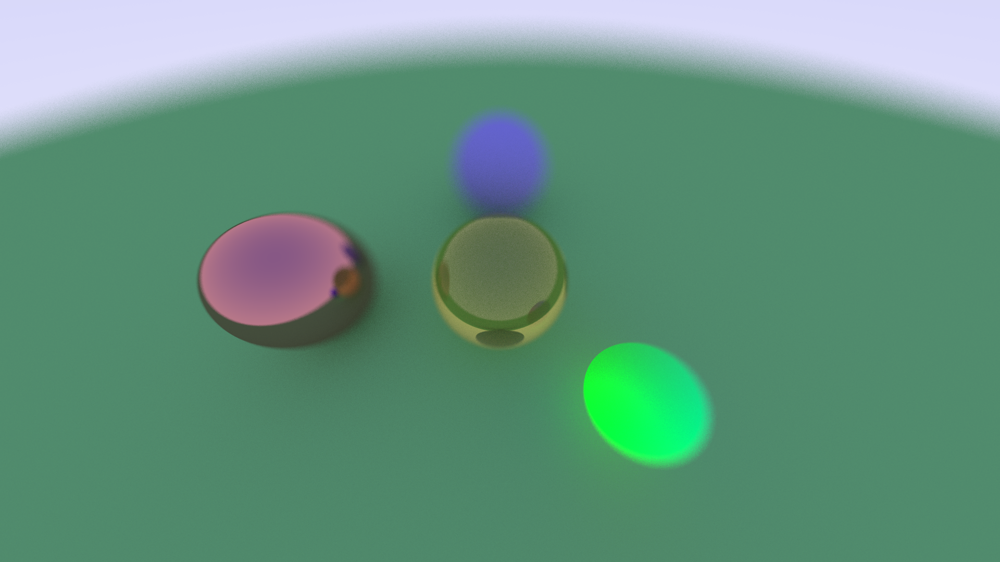

# Felix's Horrible Raytracer
My own attempt on making a raytracer following the [_Ray Tracing in One Weekend_](https://raytracing.github.io/books/RayTracingInOneWeekend.html) book, on Rust.

## Notes
* It outputs a PNG instead of a PPM
* I used different names for structs/classes

## TODO List
1. Definitely make the code better
2. Read options and scene description from a file instead of hardcoding them
3. Implement multi-threading, could use rayon but i want to implement it by my own
4. [_Ray Tracing: The Next Week_](https://raytracing.github.io/books/RayTracingTheNextWeek.html)
